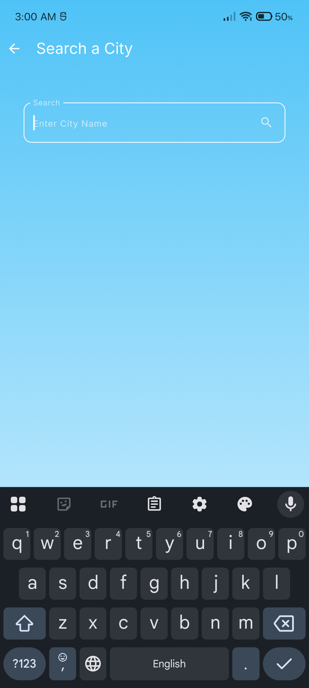
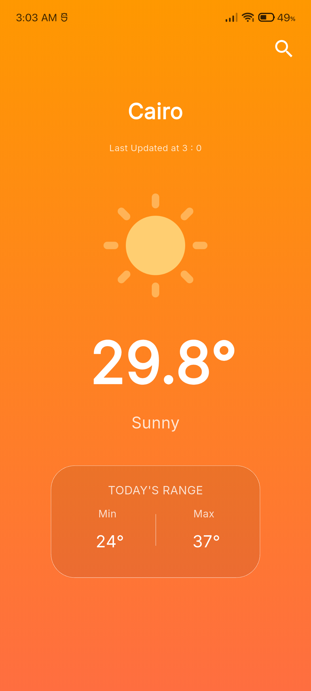
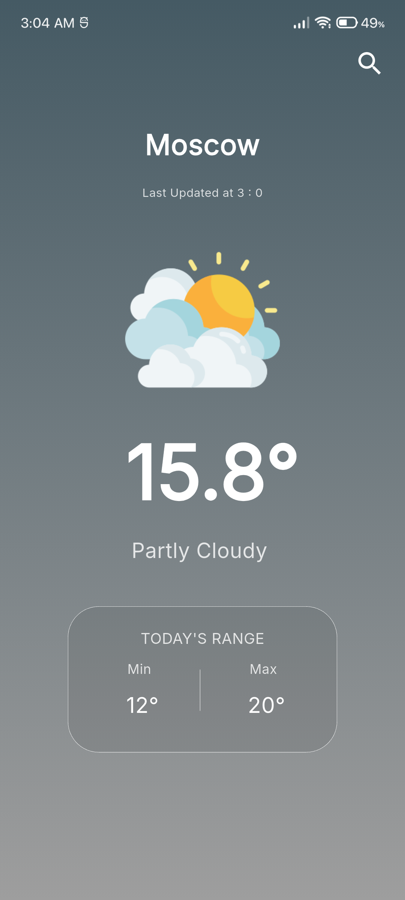
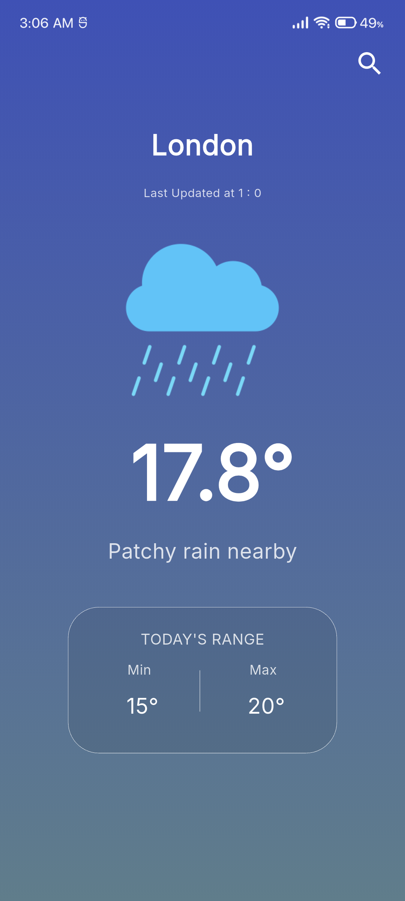

# Flutter Weather App 🌦️

A simple and clean weather application built with **Flutter** using the [WeatherAPI](https://www.weatherapi.com/).

## Features
- Search weather by city name
- Shows temperature, condition, and forecast
- Dynamic gradient backgrounds and icons based on weather condition
- Built with **Cubit (Bloc)** for state management

## Screenshots
### Home Screen

### Search Screen

### Weather Details

---

## About
This project was created as a training project for practicing **Flutter**, **State Management (Cubit)**, and integrating with REST APIs.
